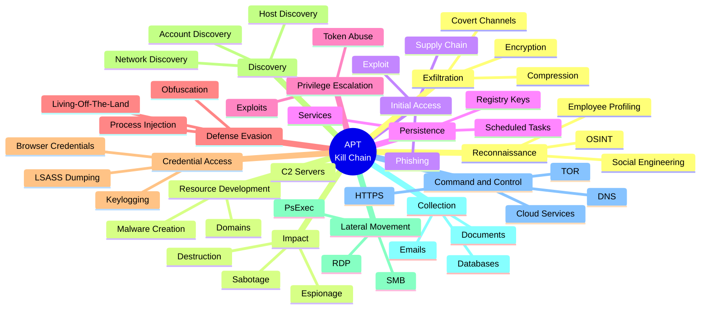
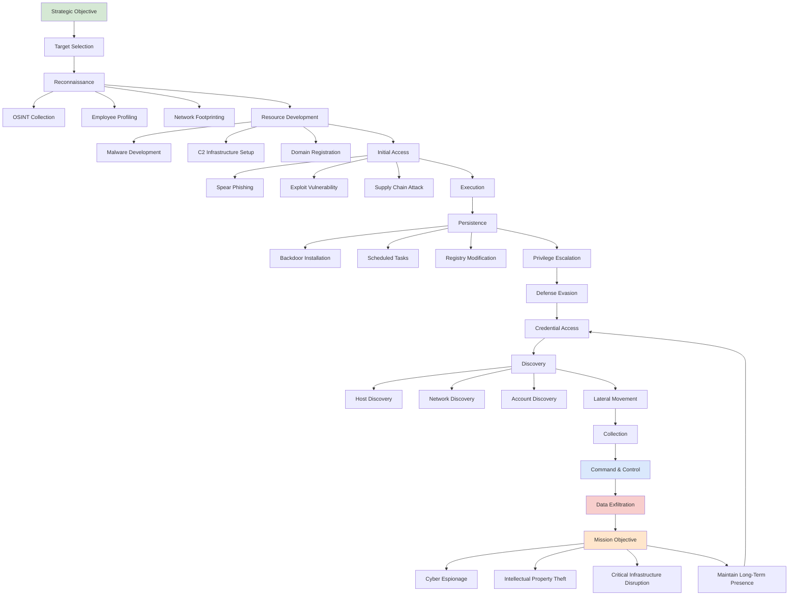

# Awesome Advanced Persistent Threat ([_APT_](https://wikipedia.org/wiki/Advanced_persistent_threat)) Resources 

 

    
    &nbsp;
    
    &nbsp;
    
    

## 📖 Contents
- [Books](#books)
- [Videos](#videos)
- [Blogs](#blogs)
- [My Other Awesome Lists](#my-other-awesome-lists)
- [Contributing](#contributing)
- [Contributors](#contributors)

## Books
- [Advanced Cyber Threat Intelligence and Hunting](https://www.amazon.com/Advanced-Cyber-Threat-Intelligence-Hunting/dp/1806380390)
- [Attribution of Advanced Persistent Threats](https://www.amazon.com/Attribution-Advanced-Persistent-Threats-Cyber-Espionage-ebook/dp/B08DCL8X8L/)

## Videos

## Blogs
- [APT Groups Encyclopedia | `Complete Threat Intelligence DB`](https://cyllex.io/encyclopedia/)
- [MITRE ATT\&CK - APT Groups](https://attack.mitre.org/groups/)

##

### My Other Awesome Lists
You can access the my other awesome lists [here](https://cyberthreatdefence.com/my_awesome_lists)

### Contributing
[Contributions of any kind welcome, just follow the guidelines](contributing.md)!

### Contributors
[Thanks goes to these contributors](https://github.com/cybersecurity-dev/awesome-advanced-persistent-threat-resource/graphs/contributors)!

### License

[🔼 Back to top](#awesome-advanced-persistent-threat-apt-resources-)
